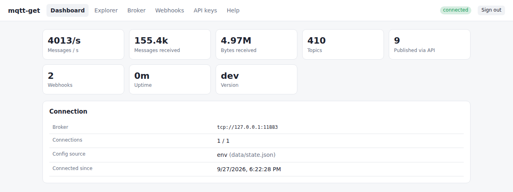
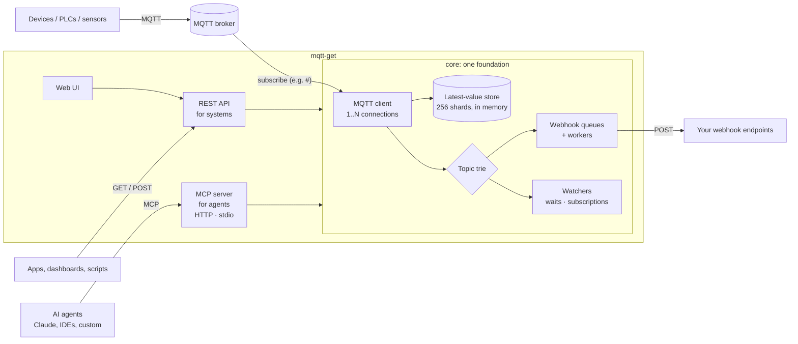
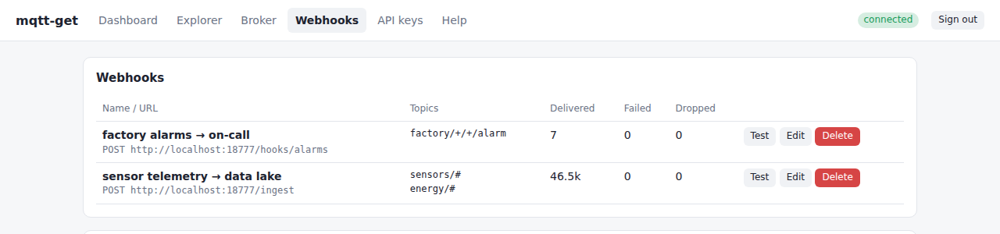
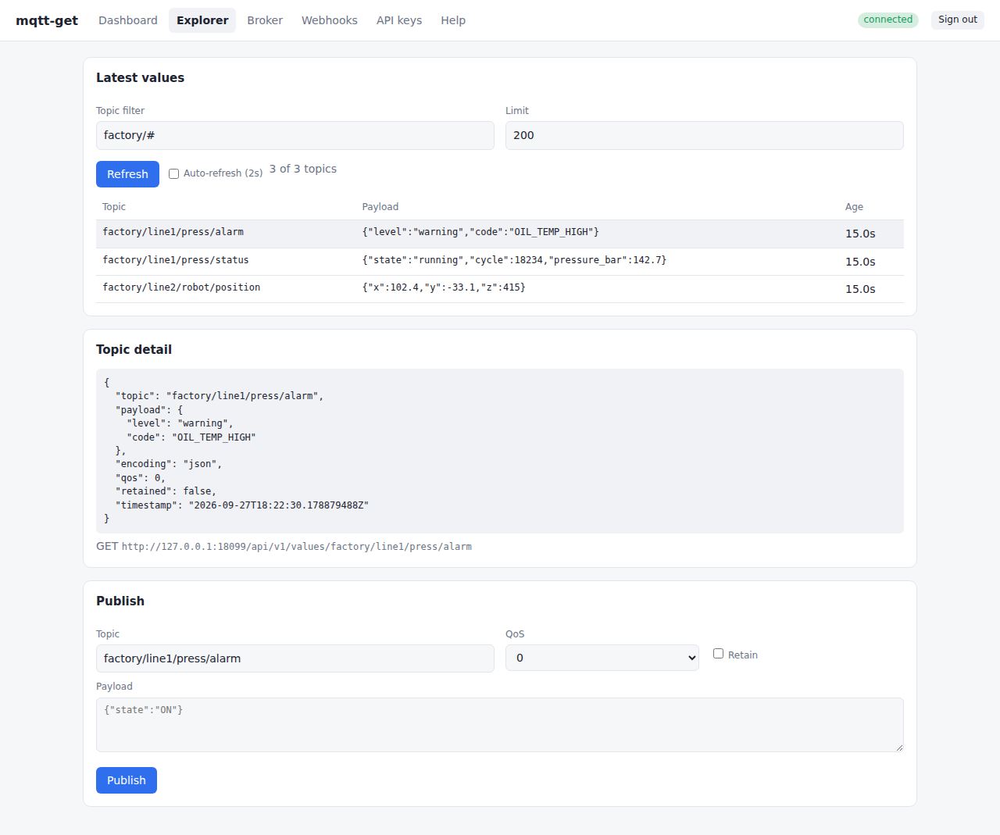
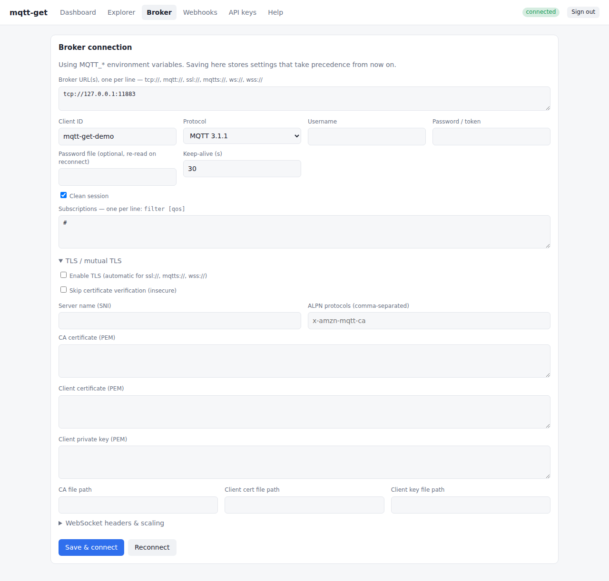

# mqtt-get

**A fast, lightweight bridge between MQTT, systems and AI agents.** mqtt-get connects to your MQTT broker and remembers the **latest value of every topic**. It serves that data through two interfaces built on the same core: a **REST API** for systems and an **MCP server** for AI agents. You can also **publish**, forward messages to **webhooks**, and configure everything from **environment variables, REST, MCP or a built-in web UI**.

[](https://github.com/tabreu8/mqtt-get/actions/workflows/ci.yml)



```bash
curl -H "Authorization: Bearer $KEY" http://localhost:8080/api/v1/values/factory/line1/press/status
```
```json
{"topic":"factory/line1/press/status","payload":{"state":"running","cycle":18234,"pressure_bar":142.7},"encoding":"json","qos":0,"retained":false,"timestamp":"2026-09-27T18:22:30.178879488Z"}
```

---

## Contents

- [Why mqtt-get](#why-mqtt-get)
- [Quick start](#quick-start)
- [How it works](#how-it-works)
- [Reading values (GET)](#reading-values-get)
- [Publishing (POST)](#publishing-post)
- [Webhooks](#webhooks)
- [Connecting to your broker](#connecting-to-your-broker) (auth methods and recipes for Mosquitto, EMQX, HiveMQ, NanoMQ, Coreflux, AWS IoT Core, Azure IoT Hub; [MQTT 5](#mqtt-5))
- [Tested brokers](#tested-brokers)
- [Configuration](#configuration)
- [Security and API keys](#security-and-api-keys)
- [Web UI](#web-ui)
- [AI agents (MCP)](#ai-agents-mcp)
- [Monitoring](#monitoring)
- [Performance and scaling](#performance-and-scaling)
- [Deployment](#deployment) (Docker, systemd, Kubernetes)
- [Troubleshooting](#troubleshooting)
- [API reference](#api-reference)
- [Development](#development)

---

## Why mqtt-get

MQTT is great for devices and poor for everything else. A dashboard, a spreadsheet, a cron job, a low-code tool or an LLM agent usually just wants to ask *"what is the current temperature in the kitchen?"* or *"turn the lamp on"* over HTTP. mqtt-get answers those questions in about a millisecond, without each consumer holding its own MQTT connection.

| | |
|---|---|
| **Latest value, instantly** | Every message is kept in memory per topic. `GET` returns the newest one; `?filter=home/+/temp` returns many at once. |
| **Publish over HTTP** | Raw body or JSON, single messages or batches, QoS 0/1/2, retain. |
| **Built for agents too** | A full MCP server (tools, resources with live notifications, prompts, completion) over HTTP or stdio, tested with the official TypeScript and Python SDKs. |
| **Webhooks** | Push matching messages to any URL, with batching, retries, HMAC signatures and backpressure. |
| **Every common broker auth method** | Anonymous, username/password or token, rotating password files, TLS, custom CA, **mutual TLS**, SNI, ALPN, WebSockets with headers, failover URLs. |
| **Simple to run** | One ~8 MB static binary or container, no dependencies, no database. |
| **Simple to configure** | Environment variables, REST, MCP or web UI. Changes apply live and are persisted. |
| **Fast** | A purpose-built MQTT client ingests ~3.3M msg/s on one connection and 6M+ on four (measured without a broker bottleneck); one allocation per message. |
| **Tested for real** | 320 end-to-end checks against Mosquitto, EMQX, HiveMQ CE, NanoMQ and Coreflux over TCP, WS, TLS, WSS and mTLS. |

## Quick start

### Docker Compose (includes a Mosquitto broker to play with)

```bash
git clone https://github.com/tabreu8/mqtt-get && cd mqtt-get
docker compose up -d
# UI:  http://localhost:8080   (API key: change-me-admin-key, set in docker-compose.yml)
```

### Docker, against your own broker

```bash
docker build -t mqtt-get .
docker run -d --name mqtt-get -p 8080:8080 -v mqtt-get-data:/data \
  -e MQTT_URL=tcp://broker.local:1883 \
  -e MQTT_USERNAME=bridge -e MQTT_PASSWORD=secret \
  -e API_KEYS=$(openssl rand -hex 24) \
  mqtt-get
```

### Binary

```bash
make build        # or: CGO_ENABLED=0 go build -o bin/mqtt-get ./cmd/mqtt-get
MQTT_URL=tcp://broker.local:1883 API_KEYS=my-secret-key ./bin/mqtt-get
```

> **No API key configured?** On first start mqtt-get generates an admin key and **prints it once** in the log:
> `level=WARN msg="no API keys configured: generated an admin key ..." api_key=mg_3f9c…`
>
> **No broker configured?** Start without `MQTT_URL` and set up the connection in the web UI.

Then try it:

```bash
export KEY=my-secret-key
curl -H "Authorization: Bearer $KEY" localhost:8080/api/v1/status
curl -H "Authorization: Bearer $KEY" "localhost:8080/api/v1/values?filter=%23&limit=20"   # %23 = '#'
curl -X POST -H "Authorization: Bearer $KEY" --data ON localhost:8080/api/v1/publish/home/lamp/set
```

## How it works



1. mqtt-get subscribes to the filters you choose (default `#`, everything).
2. Every message replaces the previous value for its topic in a sharded in-memory map. The payload is stored as-is and never copied again.
3. The message is matched, using lock-free topic tries, against webhook filters (each webhook has its own bounded queue) and against active watchers (agents waiting for events, resource subscriptions).
4. **REST and MCP are two thin interfaces over the same core.** Every operation, validation rule, scope check and error is implemented once, so both behave the same way. The interfaces only differ in presentation: REST speaks HTTP and JSON for systems, while MCP adds what agents need (discovery, events, safety hints).

Values live in memory. After a restart they are rebuilt as messages arrive, and **retained** messages are replayed by the broker immediately on subscribe. Configuration (broker settings, webhooks, API keys) is persisted to `DATA_DIR/state.json`.

## Reading values (GET)

### One topic

```bash
curl -H "Authorization: Bearer $KEY" localhost:8080/api/v1/values/home/kitchen/temperature
```
```json
{"topic":"home/kitchen/temperature","payload":{"celsius":23.1,"humidity":51},"encoding":"json","qos":0,"retained":true,"timestamp":"2026-09-27T18:22:30.1788Z"}
```

`payload` is decoded according to `encoding`:

| `encoding` | When | `payload` holds |
|---|---|---|
| `json` | The payload is valid JSON | The JSON value itself (object, number, string, …) |
| `utf8` | Text that isn't JSON | A string |
| `base64` | Binary | A base64 string |

Options:

| Query | Effect |
|---|---|
| `?format=raw` | Return **only the payload bytes**, with a matching `Content-Type`. Ideal for shell scripts: `TEMP=$(curl -s …?format=raw)` |
| `?max_age=30s` | Return **404** if the latest value is older than that (Go duration: `500ms`, `5m`, `1h`). Catches silent sensors. |
| `?topic=/odd//name` | Alternative to the path, for topic names with a leading `/` or empty levels |

Every response also carries `X-MQTT-Topic`, `X-MQTT-QoS`, `X-MQTT-Retained` and `X-MQTT-Timestamp` headers.

### Many topics (wildcards)

```bash
# every temperature, one level of wildcard (+ must be URL-encoded as %2B, # as %23)
curl -H "Authorization: Bearer $KEY" "localhost:8080/api/v1/values?filter=home/%2B/temperature"
```
```json
{"total":3,"count":3,"values":[
  {"topic":"home/bedroom/temperature","payload":{"celsius":19.8,"humidity":47},"encoding":"json","qos":0,"retained":true,"timestamp":"…"},
  {"topic":"home/kitchen/temperature","payload":{"celsius":23.1,"humidity":51},"encoding":"json","qos":0,"retained":true,"timestamp":"…"},
  {"topic":"home/livingroom/temperature","payload":{"celsius":21.4,"humidity":44},"encoding":"json","qos":0,"retained":true,"timestamp":"…"}]}
```

Results are sorted by topic. `limit` defaults to 1000 (max 100000); `total` is the number of matches before the limit. To list topic names only (with payload size and time), use `GET /api/v1/topics?filter=…`.

### Recipes

```bash
# jq: the kitchen temperature as a number
curl -s -H "Authorization: Bearer $KEY" localhost:8080/api/v1/values/home/kitchen/temperature | jq .payload.celsius

# Python
import requests
v = requests.get("http://mqtt-get:8080/api/v1/values/home/kitchen/temperature",
                 headers={"Authorization": "Bearer " + KEY}, timeout=2).json()
print(v["payload"]["celsius"])
```

Grafana (Infinity data source), Home Assistant (`rest` sensor), Node-RED (`http request`), Excel or Google Sheets (`WEBSERVICE`/Apps Script) and most low-code tools can call these URLs directly. Use a **read-only key** for them.

## Publishing (POST)

### Raw body

```bash
curl -X POST -H "Authorization: Bearer $KEY" --data 'ON' \
  "localhost:8080/api/v1/publish/home/lamp/set?qos=1&retain=true"
# {"ok":true,"published":1}
```

The body is sent byte for byte, so binary data works too (`--data-binary @file.bin`).

### JSON: one message or a batch

```bash
curl -X POST -H "Authorization: Bearer $KEY" -H 'Content-Type: application/json' localhost:8080/api/v1/publish -d '[
  {"topic": "home/lamp/set",       "payload": "ON"},
  {"topic": "home/thermostat/set", "payload": {"target": 21.5}, "qos": 1, "retain": true},
  {"topic": "devices/42/firmware", "payload": "AAECAwQ=", "encoding": "base64", "qos": 1}
]'
# {"ok":true,"published":3}
```

- A **string** payload is sent as its text (`"ON"` → `ON`).
- Any **other JSON value** is sent as its JSON text (`{"target":21.5}`).
- `"encoding": "base64"` decodes the string into binary first.

Batches are pipelined. All messages are handed to the broker first, then acknowledgements are awaited, so a batch of 1000 QoS 1 messages takes about one round trip instead of 1000. QoS 1/2 publishes return only after the broker acknowledges them (timeout `PUBLISH_TIMEOUT_MS`).

If the broker is unreachable you get **503** `{"error":"not connected to MQTT broker"}`, and nothing is queued.

## Webhooks

A webhook forwards every message that matches its topic filters to an HTTP endpoint.



```bash
curl -X POST -H "Authorization: Bearer $KEY" localhost:8080/api/v1/webhooks -d '{
  "name": "factory alarms → on-call",
  "url": "https://example.com/hooks/alarms",
  "topics": ["factory/+/+/alarm"],
  "secret": "my-webhook-secret",
  "headers": {"Authorization": "Bearer downstream-token"}
}'
```

### What your endpoint receives

**`format: "json"` (default), one message per request:**

```http
POST /hooks/alarms
Content-Type: application/json
X-MQTT-Get-Webhook: 5a7c1f76200611bc
X-MQTT-Get-Timestamp: 1790532483
X-MQTT-Get-Signature: sha256=8d1c…

{"topic":"factory/line1/press/alarm","payload":{"level":"warning","code":"OIL_TEMP_HIGH"},"encoding":"json","qos":0,"retained":false,"timestamp":"2026-09-27T18:22:30.1788Z"}
```

**With `batch_size > 1`**, up to that many messages go in each request. A request is sent when the batch is full or `batch_interval_ms` has passed:

```json
{"messages":[{"topic":"sensors/1/temp","payload":20.1,…},{"topic":"sensors/2/temp","payload":19.7,…}]}
```

**`format: "raw"`** sends the payload bytes as the body, with the metadata in headers (`X-MQTT-Topic`, `X-MQTT-QoS`, `X-MQTT-Retained`, `X-MQTT-Timestamp`). Handy for endpoints that expect exactly what the device sent.

### Verifying signatures

If `secret` is set, every request is signed as `HMAC-SHA256(secret, timestamp + "." + raw_body)`, hex-encoded. Both snippets below were tested against real deliveries.

<details><summary>Python</summary>

```python
import hashlib, hmac, time

SECRET = b"my-webhook-secret"

def verify(headers, body: bytes) -> bool:
    ts = headers.get("X-MQTT-Get-Timestamp", "")
    sig = headers.get("X-MQTT-Get-Signature", "")
    expected = "sha256=" + hmac.new(SECRET, ts.encode() + b"." + body, hashlib.sha256).hexdigest()
    fresh = ts.isdigit() and abs(time.time() - int(ts)) < 300   # reject replays
    return fresh and hmac.compare_digest(sig, expected)
```
</details>

<details><summary>Node.js</summary>

```js
const crypto = require('crypto');
const SECRET = 'my-webhook-secret';

function verify(headers, rawBody /* Buffer */) {
  const ts = headers['x-mqtt-get-timestamp'] || '';
  const sig = headers['x-mqtt-get-signature'] || '';
  const expected = 'sha256=' + crypto.createHmac('sha256', SECRET).update(ts + '.').update(rawBody).digest('hex');
  const fresh = Math.abs(Date.now() / 1000 - Number(ts)) < 300; // reject replays
  return fresh && sig.length === expected.length &&
    crypto.timingSafeEqual(Buffer.from(sig), Buffer.from(expected));
}
```
</details>

### Delivery guarantees

| | |
|---|---|
| **Retries** | Network errors, HTTP 5xx, 408 and 429 are retried with exponential backoff (250 ms, 500 ms, 1 s, … up to 10 s), `max_retries` times (default 3). Other 4xx responses aren't retried. |
| **Isolation** | Each webhook has its own queue (`queue_size`, default 10000) and `concurrency` workers (default 1). A slow or dead endpoint **never** slows down ingestion or other webhooks. |
| **Backpressure** | When a webhook's queue is full, new messages for **that webhook** are dropped and counted (`dropped` in the UI and API, `mqttget_webhook_dropped_total`). Increase `batch_size`, `concurrency` or `queue_size` for high-volume topics. |
| **Ordering** | With `concurrency: 1`, messages are delivered in the order received. |
| **Durability** | Queues are in memory; messages still queued at shutdown are lost. mqtt-get is a bridge, not a message store. For guaranteed delivery, consume the broker directly with a persistent session. |

**Test a webhook** without waiting for traffic: `POST /api/v1/webhooks/{id}/test` sends a sample message (or `{"topic": "...", "payload": ...}` if given) and returns the endpoint's result.

<details><summary>All webhook fields</summary>

| Field | Default | |
|---|---|---|
| `url` | required | `http://` or `https://` |
| `topics` | required | MQTT filters, e.g. `["alarms/#", "+/status"]` |
| `name` | | Label shown in the UI |
| `id` | generated | Set your own id if you like |
| `method` | `POST` | `POST`, `PUT` or `PATCH` |
| `format` | `json` | `json` or `raw` |
| `headers` | | Extra request headers (values with auth-like names are redacted in responses) |
| `secret` | | Turns on HMAC signatures |
| `batch_size` | `1` | JSON format only |
| `batch_interval_ms` | `200` | Maximum wait for a batch to fill |
| `timeout_ms` | `5000` | Per request |
| `max_retries` | `3` | |
| `queue_size` | `10000` | |
| `concurrency` | `1` | Parallel requests (ordering is only guaranteed at 1) |
| `enabled` | `true` | Disable without deleting |
</details>

## Connecting to your broker

### Supported authentication and transports

| Method | Configure with | Notes |
|---|---|---|
| Anonymous | `MQTT_URL` | |
| Username + password | `MQTT_USERNAME`, `MQTT_PASSWORD` | Also used for **tokens** (JWT, SAS, API keys) sent as the password |
| Rotating token / Docker secret | `MQTT_PASSWORD_FILE` | The file is **re-read on every reconnect**, so update the file and the next reconnect uses the new token |
| TLS, public CA | `mqtts://host:8883` | Uses the system trust store |
| TLS, private CA | `+ MQTT_TLS_CA_FILE` or `MQTT_TLS_CA_PEM` | Added to the system roots |
| **Mutual TLS** | `+ MQTT_TLS_CERT_FILE` and `MQTT_TLS_KEY_FILE` (or `_PEM`) | RSA and ECDSA keys, PEM |
| TLS name override (SNI) | `MQTT_TLS_SERVER_NAME` | When connecting by IP, or through a tunnel |
| ALPN | `MQTT_TLS_ALPN` | e.g. `x-amzn-mqtt-ca` for AWS IoT on port 443 |
| Self-signed, no verification | `MQTT_TLS_INSECURE=true` | Testing only |
| TLS on a `tcp://` URL | `MQTT_TLS=true` | Upgrades `tcp://` / `mqtt://` URLs to TLS (default port 8883) |
| MQTT over WebSocket | `ws://host/mqtt`, `wss://host/mqtt` | Include the broker's path (often `/mqtt`) |
| WebSocket auth headers | `MQTT_WS_HEADERS="Authorization: Bearer x"` | For gateways and proxies |
| Unix socket | `unix:///run/mosquitto.sock` | |
| Failover | `MQTT_URL=ssl://a:8883,ssl://b:8883` | Tried in order |

URL schemes: `tcp`, `mqtt`, `ssl`, `tls`, `mqtts`, `mqtt+ssl`, `tcps`, `ws`, `wss`, `unix`. Default ports are 1883 (plain) and 8883 (TLS). Protocols: MQTT **3.1.1** (default), **MQTT 5** (`MQTT_PROTOCOL_VERSION=5`, see [MQTT 5](#mqtt-5)) and 3.1. Every authentication method and transport above works with both.

### MQTT 5

Set `MQTT_PROTOCOL_VERSION=5` (or `protocol_version: 5` in the UI, API or MCP) to get:

| Feature | What mqtt-get does with it |
|---|---|
| **Message properties** | Content type, response topic, correlation data, user properties (repeated keys kept), message expiry and payload format are stored with each value. They are returned by REST (`"properties": {…}` in JSON, `X-MQTT-*` headers with `?format=raw`), MCP and webhooks. You can set them when publishing. |
| **Message expiry** | A value published with `message_expiry_sec` is no longer served after it expires: `GET` returns `404 … expired`, and it drops out of filters and listings. MCP shows `expires_in_seconds`. |
| **Request/response** | MCP `publish_and_wait` (and the core behind it) sets a **response topic** and random **correlation data** on the request. Replies carrying someone else's correlation data are ignored; the result says whether it was `correlated`. |
| **Reason codes** | Refused connections, rejected subscriptions and publishes, and server disconnects show the MQTT 5 reason, e.g. `connect failed: reason 0x86 bad user name or password`. |
| **Topic aliases** | The broker may replace long topic names with 2-byte aliases (up to `MQTT_TOPIC_ALIAS_MAXIMUM`, default 1024), which saves bandwidth. mqtt-get resolves them per connection. |
| **Sessions and flow control** | `MQTT_SESSION_EXPIRY_SEC` keeps the session across reconnects. mqtt-get accepts up to 65535 in-flight QoS 1/2 messages from the broker, and respects the broker's own limits when publishing: its Receive Maximum (in-flight QoS 1/2 publishes), Maximum QoS, Retain Available and Maximum Packet Size. A publish the broker can't accept fails with a clear error instead of getting the connection dropped. |
| **Server keep alive** | If the broker overrides the keepalive in CONNACK, mqtt-get uses the broker's value. |

Publishing with properties:

```bash
# JSON
curl -X POST -H "Authorization: Bearer $KEY" localhost:8080/api/v1/publish -d '{
  "topic": "devices/lamp/set", "payload": {"state": "ON"}, "qos": 1,
  "properties": {"content_type": "application/json", "response_topic": "devices/lamp/reply",
                 "correlation_data": "req-42", "user_properties": {"source": "dashboard"}, "message_expiry_sec": 30}}'

# raw body + headers (X-MQTT-User-Property can repeat)
curl -X POST -H "Authorization: Bearer $KEY" -H "X-MQTT-Content-Type: text/plain" \
     -H "X-MQTT-User-Property: source=cron" --data 'ON' localhost:8080/api/v1/publish/devices/lamp/set
```

Header names: `X-MQTT-Content-Type`, `X-MQTT-Response-Topic`, `X-MQTT-Correlation-Data` (base64), `X-MQTT-Message-Expiry` (seconds), `X-MQTT-User-Property` (`key=value`, repeatable) and `X-MQTT-Payload-Format` (`utf8`). Publishing properties over an MQTT 3.1.1 connection returns `400`.

Tested on Mosquitto, EMQX, HiveMQ CE, NanoMQ and Coreflux over TCP, TLS, mTLS and WSS (see [Tested brokers](#tested-brokers)). MQTT 5 enhanced authentication (AUTH packets, e.g. SCRAM) isn't supported yet.

> Over WebSocket, mqtt-get always sends one complete MQTT packet per WebSocket frame. The MQTT spec allows packets to be split across frames, but Mosquitto 2 rejects that for MQTT 5, and aligned frames work everywhere.

TLS settings can be given as **file paths** (good for mounted secrets) or **inline PEM** (good for the UI and API). If you set both, the PEM wins. TLS 1.2+ is enforced.

### Recipes

<details open><summary><b>Mosquitto</b></summary>

```bash
MQTT_URL=mqtts://mosquitto.local:8883
MQTT_USERNAME=bridge
MQTT_PASSWORD=secret
MQTT_TLS_CA_FILE=/certs/ca.crt
# mTLS instead of / in addition to a password (listener with require_certificate true):
MQTT_TLS_CERT_FILE=/certs/client.crt
MQTT_TLS_KEY_FILE=/certs/client.key
```
Mosquitto 2.x supports `$share` for 3.1.1 clients, so both `MQTT_SHARED_GROUP` and `MQTT_SUBSCRIPTION_MODE=split` work.
</details>

<details><summary><b>EMQX</b> (self-hosted or EMQX Cloud)</summary>

```bash
MQTT_URL=mqtts://xxxxxxxx.ala.eu-central-1.emqxsl.com:8883   # or ssl://emqx.local:8883
MQTT_USERNAME=bridge
MQTT_PASSWORD=secret
# WebSocket alternative:  MQTT_URL=wss://…:8084/mqtt
```
Shared subscriptions are supported.
</details>

<details><summary><b>HiveMQ</b> (HiveMQ Cloud or self-hosted)</summary>

```bash
MQTT_URL=mqtts://xxxxxxxx.s1.eu.hivemq.cloud:8883
MQTT_USERNAME=bridge
MQTT_PASSWORD=secret
# WebSocket alternative:  MQTT_URL=wss://xxxxxxxx.s1.eu.hivemq.cloud:8884/mqtt
```
HiveMQ Community Edition enforces TLS/mTLS on its listeners, but ships only an allow-all auth extension, so passwords aren't checked unless you add an auth extension.
</details>

<details><summary><b>NanoMQ</b></summary>

```bash
MQTT_URL=tls://nanomq.local:8883
MQTT_USERNAME=bridge
MQTT_PASSWORD=secret
MQTT_TLS_CA_FILE=/certs/ca.crt
```
TLS requires NanoMQ's `-full` build (the default image has no TLS).
</details>

<details><summary><b>Coreflux</b></summary>

```bash
MQTT_URL=mqtts://coreflux.local:8883
MQTT_USERNAME=bridge
MQTT_PASSWORD=secret
MQTT_TLS_CA_FILE=/certs/ca.crt
```
- **mTLS:** Coreflux pins client certificates rather than trusting a CA. Copy mqtt-get's client certificate as a `.pem` file into the broker's `ClientCertificateSourcePath` directory.
- **Scale-out:** Coreflux 2.14 rejects `$share/...` subscriptions, so use `MQTT_SUBSCRIPTION_MODE=split` (tested) instead of `MQTT_SHARED_GROUP`.
- New Coreflux installs allow anonymous login by default.
</details>

<details><summary><b>AWS IoT Core</b> (mutual TLS)</summary>

```bash
MQTT_URL=mqtts://xxxxxxxxxxxxxx-ats.iot.eu-west-1.amazonaws.com:8883
MQTT_CLIENT_ID=mqtt-get-bridge                 # must be allowed by your IoT policy
MQTT_TLS_CERT_FILE=/certs/device.pem.crt
MQTT_TLS_KEY_FILE=/certs/private.pem.key
MQTT_TOPICS=factory/#                          # the policy must allow iot:Subscribe/Receive on these
# Firewall only allows 443?  Use ALPN:
# MQTT_URL=mqtts://xxxxxxxxxxxxxx-ats.iot.eu-west-1.amazonaws.com:443
# MQTT_TLS_ALPN=x-amzn-mqtt-ca
```
Amazon's root CA is in standard system trust stores (including the Docker image), so `MQTT_TLS_CA_FILE` is usually unnecessary. If `MQTT_CONNECTIONS` > 1, each connection uses `<client_id>-<n>` as its client ID, so allow that pattern in the policy.
</details>

<details><summary><b>Azure IoT Hub</b> (SAS token)</summary>

```bash
MQTT_URL=mqtts://my-hub.azure-devices.net:8883
MQTT_CLIENT_ID=my-device
MQTT_USERNAME=my-hub.azure-devices.net/my-device/?api-version=2021-04-12
MQTT_PASSWORD_FILE=/run/secrets/sas-token     # "SharedAccessSignature sr=…&sig=…&se=…"
MQTT_TOPICS=devices/my-device/messages/devicebound/#
```
SAS tokens expire. Refresh the file (e.g. with a sidecar or cron job) and mqtt-get picks up the new token on the next reconnect. IoT Hub only lets a device subscribe to its own topics, so `#` isn't allowed.
</details>

<details><summary><b>Behind a WebSocket gateway</b> (e.g. an API gateway or Cloudflare Access)</summary>

```bash
MQTT_URL=wss://gateway.example.com/mqtt
MQTT_WS_HEADERS="Authorization: Bearer eyJ…,X-Tenant: acme"
```
</details>

### Choosing what to subscribe to

`MQTT_TOPICS` defaults to `#` (everything). On busy brokers, narrow it to what you actually need. That reduces traffic and memory, and matters for brokers that restrict wildcard subscriptions:

```bash
MQTT_TOPICS="factory/+/+/status:1,factory/+/+/alarm:1,energy/#"   # ":1" sets QoS 1 for that filter
```

`$SYS/...` topics are only received if you subscribe to them explicitly (`$SYS/#`), because `#` never matches them.

## Tested brokers

mqtt-get ships with an **interoperability suite** that runs the full stack (REST, publish at every QoS, retained replay, binary payloads, wildcards, webhooks and negative auth checks) against real brokers. Last run: **643 passed, 0 failed** over 47 endpoints (MQTT 3.1.1 and MQTT 5).

| Broker | Version | TCP | Password | WS | TLS | mTLS | WSS | MQTT 5 | `split` scale-out | `$share` scale-out |
|---|---|---|---|---|---|---|---|---|---|---|
| Eclipse Mosquitto | 2.1.2 / 2.0.18 | ✅ | ✅ | ✅ | ✅ | ✅ | ✅ | ✅ | ✅ | ✅ |
| EMQX | 6.3.1 | ✅ | ✅ | ✅ | ✅ | ✅ | ✅ | ✅ | ✅ | ✅ |
| HiveMQ CE | 2026.5 | ✅ | n/a | ✅ | ✅ | ✅ | ✅ | ✅ | ✅ | ✅ |
| NanoMQ (`-full`) | 0.25.6 | ✅ | ✅ | ✅ | ✅ | ✅ | ✅ | ✅ | ✅ | ✅ |
| Coreflux | 2.14.3 | ✅ | ✅ | ✅ | ✅ | ✅ | ✅ | ✅ | ✅ | ❌ not supported by broker |
| mochi-mqtt | 2.7.9 | ✅ | ✅ | ✅ | ✅ | ✅ | ✅ | ✅ | ✅ | – |

"MQTT 5" means every transport and auth method of that broker was also run over MQTT 5, plus properties both ways, message expiry and correlated request/response.

Details, per-check results, broker configuration notes and instructions for running it against **your own broker** are in [`test/interop/README.md`](test/interop/README.md).

## Configuration

mqtt-get reads **environment variables** at startup. Broker settings can also be changed at runtime from the **web UI, REST API or MCP**. Those changes take effect immediately and are saved to `DATA_DIR/state.json`.

> **Precedence:** once broker settings are saved from the UI, API or MCP, they **override** the `MQTT_*` variables on later restarts. The dashboard shows the active source (`env` or `saved`). To go back to environment-only configuration, delete the `broker` entry (or the whole file) from `state.json`.

### MQTT connection

| Variable | Default | Description |
|---|---|---|
| `MQTT_URL` | – | Broker URL(s), comma-separated for failover |
| `MQTT_TOPICS` | `#` | Filters to subscribe to, comma-separated; each can end in `:0`, `:1` or `:2` |
| `MQTT_QOS` | `0` | Default subscription QoS |
| `MQTT_CLIENT_ID` | `mqtt-get-<hostname>` | Must be unique on the broker |
| `MQTT_USERNAME` / `MQTT_PASSWORD` | – | |
| `MQTT_PASSWORD_FILE` | – | Read on every (re)connect; trailing newline stripped |
| `MQTT_PROTOCOL_VERSION` | `4` | `4` = MQTT 3.1.1, `5` = [MQTT 5](#mqtt-5), `3` = MQTT 3.1 |
| `MQTT_SESSION_EXPIRY_SEC` | `0` | MQTT 5: keep the session this long after a disconnect |
| `MQTT_TOPIC_ALIAS_MAXIMUM` | `1024` | MQTT 5: topic aliases the broker may use towards mqtt-get (`0` disables) |
| `MQTT_CLEAN_SESSION` | `true` | |
| `MQTT_KEEPALIVE_SEC` | `30` | |
| `MQTT_CONNECT_TIMEOUT_SEC` | `10` | |
| `MQTT_TLS` | `false` | Force TLS for `tcp://` / `mqtt://` URLs |
| `MQTT_TLS_CA_FILE` / `MQTT_TLS_CA_PEM` | – | Extra trusted CA |
| `MQTT_TLS_CERT_FILE` / `MQTT_TLS_CERT_PEM` | – | Client certificate (mTLS) |
| `MQTT_TLS_KEY_FILE` / `MQTT_TLS_KEY_PEM` | – | Client private key (mTLS) |
| `MQTT_TLS_SERVER_NAME` | – | SNI / verification name |
| `MQTT_TLS_ALPN` | – | Comma-separated ALPN protocols |
| `MQTT_TLS_INSECURE` | `false` | Skip server certificate verification |
| `MQTT_WS_HEADERS` | – | `Name: value`, comma-separated |
| `MQTT_CONNECTIONS` | `1` | Number of broker connections (see [scaling](#performance-and-scaling)) |
| `MQTT_SHARED_GROUP` | – | Shared-subscription group spreading ingest over the connections (broker must support `$share`) |
| `MQTT_CLIENT` | `lean` | MQTT client: `lean` (built-in, fastest, all protocol versions) or `paho` (Eclipse paho for 3.1/3.1.1, Eclipse paho.golang for MQTT 5) |
| `MQTT_SUBSCRIPTION_MODE` | `auto` | `split` divides `MQTT_TOPICS` between the connections: scale-out without broker support (filters must not overlap) |

### Server

| Variable | Default | Description |
|---|---|---|
| `HTTP_ADDR` | `:8080` | Listen address |
| `HTTP_TLS_CERT_FILE` / `HTTP_TLS_KEY_FILE` | – | Serve HTTPS directly |
| `API_KEYS` | – | Admin keys, comma-separated |
| `API_KEYS_READ` | – | Read-only keys |
| `API_KEYS_PUBLISH` | – | Read + publish keys |
| `AUTH_DISABLED` | `false` | Turn off API authentication (trusted networks only) |
| `ALLOW_QUERY_API_KEY` | `false` | Also accept `?api_key=` (for clients that can't set headers) |
| `DATA_DIR` | `./data` | Where `state.json` is kept (`/data` in the Docker image) |
| `MAX_TOPICS` | `1000000` | Memory guard: new topics beyond this are not stored (counted in metrics) |
| `MAX_BODY_BYTES` | `1048576` | Maximum request body |
| `PUBLISH_TIMEOUT_MS` | `5000` | Maximum wait for broker acknowledgement |
| `UI_ENABLED` | `true` | Serve the web UI at `/` |
| `MCP_ENABLED` | `true` | Serve MCP at `/mcp` |
| `MCP_SCOPES` | `admin` | Scopes of the local agent in standalone `mqtt-get mcp` (stdio) mode, e.g. `read` or `read,publish` |
| `METRICS_PUBLIC` | `false` | Serve `/metrics` without an API key |
| `CORS_ORIGINS` | – | e.g. `*` or `https://dash.example.com,https://app.example.com` |
| `LOG_LEVEL` | `info` | `debug`, `info`, `warn`, `error` |
| `GOGC` / `GOMEMLIMIT` | adaptive | Standard Go GC settings; setting either disables the automatic tuning (see [Memory and GC](#memory-and-gc)) |
| `LOG_FORMAT` | `text` | `text` or `json` |
| `PPROF_ADDR` | – | e.g. `127.0.0.1:6060` to enable Go profiling |

### Configuring over the API

`GET /api/v1/broker` returns the current settings, with secrets shown as `********`. Send the same document back with your changes to `PUT /api/v1/broker`. Any field still holding `********` keeps its stored value, so you never need to re-enter a password to change something else.

```bash
curl -s -H "Authorization: Bearer $KEY" localhost:8080/api/v1/broker | jq .config > broker.json
# edit broker.json …
curl -X PUT -H "Authorization: Bearer $KEY" localhost:8080/api/v1/broker --data @broker.json
```

The broker document:

```json
{
  "urls": ["mqtts://broker.example.com:8883"],
  "client_id": "mqtt-get-prod",
  "username": "bridge",
  "password": "********",
  "password_file": "",
  "protocol_version": 4,
  "clean_session": true,
  "keepalive_sec": 30,
  "connect_timeout_sec": 10,
  "tls": {
    "enabled": false, "ca_file": "", "ca_pem": "", "cert_file": "", "cert_pem": "",
    "key_file": "", "key_pem": "", "server_name": "", "insecure_skip_verify": false, "alpn": []
  },
  "ws_headers": {},
  "subscriptions": [{"filter": "#", "qos": 0}],
  "connections": 1,
  "shared_group": ""
}
```

## Security and API keys

Every API call needs a key, sent as `Authorization: Bearer <key>` or `X-API-Key: <key>`.

| Scope | Allows |
|---|---|
| `read` | Latest values, topic lists, status, metrics |
| `publish` | Publishing (give it `read` too if the client also reads) |
| `admin` | Everything, including broker settings, webhooks and API keys |

```bash
curl -X POST -H "Authorization: Bearer $ADMIN_KEY" localhost:8080/api/v1/keys \
  -d '{"name": "grafana", "scopes": ["read"]}'
# {"key":"mg_7c1e…","info":{"id":"…","name":"grafana","prefix":"mg_7c1e4a…","scopes":["read"],…},"note":"store this key now; it cannot be retrieved again"}
```

- Only the **SHA-256 hash** of each key is stored; a key is shown once, when it's created.
- Keys from environment variables are never written to disk and can't be deleted through the API.
- A key can't delete itself, so you can't lock yourself out by accident.
- Secrets (MQTT password, private key, webhook secrets, auth headers) are **never returned** by the API. They appear as `********`.

**Production checklist**

- [ ] Put mqtt-get behind HTTPS (reverse proxy, or `HTTP_TLS_CERT_FILE`/`HTTP_TLS_KEY_FILE`).
- [ ] Use a **read-only** key for dashboards and a **publish** key for controllers; keep `admin` for people.
- [ ] Give mqtt-get a broker account with ACLs limited to the topics it needs.
- [ ] Use TLS (ideally mTLS) to the broker, and keep `MQTT_TLS_INSECURE` off.
- [ ] Protect `DATA_DIR` (it holds broker credentials; the file is written with mode `0600`).
- [ ] Set `UI_ENABLED=false` or `MCP_ENABLED=false` if you don't use them.
- [ ] Sign webhooks (`secret`) and verify signatures on the receiving side.

## Web UI

Open `http://<host>:8080/` and sign in with an API key. The UI uses the same REST API, and what you can do depends on the key's scopes.

| Dashboard | Explorer |
|---|---|
|  |  |

- **Dashboard**: connection state, live message rate, counters, last error.
- **Explorer**: browse latest values by filter (with auto-refresh), inspect a topic, copy its GET URL, publish messages.
- **Broker**: every connection option, including pasting PEM certificates, with *Save & connect*.
- **Webhooks**: create, edit, test and delete, with live delivered/failed/dropped counters and the last error.
- **API keys**: create (shown once) and revoke.
- **Help**: ready-to-paste `curl` and MCP snippets for this server.

<details><summary>Broker settings screen</summary>


</details>

## AI agents (MCP)

REST is the interface for **systems**; MCP (Model Context Protocol) is the interface for **agents**. Both run on the same core, so an agent can do everything a REST client can, limited by its API key's scopes. On top of that it gets features built for how agents work:

| Agents need to… | mqtt-get provides |
|---|---|
| **Discover** an unknown namespace | `describe_topic_tree` summarizes the topic hierarchy level by level (topic counts, last update), so a namespace of 1M topics can be explored in a few calls. Near-miss topic names get *"did you mean"* suggestions. |
| **React** to events instead of polling | `wait_for_message` blocks until a matching message arrives. **Resource subscriptions** push `notifications/resources/updated` when a topic changes, coalesced to at most one per second per resource. |
| **Act and confirm** | `publish_and_wait` sends a command and returns the device's response or state change (e.g. publish to `lamp/set`, wait on `lamp/state`). |
| **Stay safe** | Tool annotations mark `publish` and configuration changes as destructive, so clients ask the user first. Server instructions tell agents to confirm before actuating devices and never guess payload formats. Keys only see the tools their scopes allow. |
| **Save context** | Compact JSON results with `structuredContent`, `age_seconds` on every value (spot stale data), large payloads truncated at 16 KB, and strict argument checking (a misspelled parameter returns an error that names it). |
| **Be guided** | Prompts for common jobs: `explore_namespace`, `monitor_topics`, `control_device`, `troubleshoot_connection`. |

### Connecting an agent

**Remote (Streamable HTTP)**, for any MCP client that supports HTTP servers:

```bash
# Claude Code
claude mcp add --transport http mqtt http://localhost:8080/mcp --header "Authorization: Bearer $KEY"
```

**Local, standalone (stdio).** `mqtt-get mcp` runs the whole service inside the agent's process. There is no HTTP server to run; configure it with the usual `MQTT_*` variables. This is ideal for Claude Desktop, IDEs and CLI agents on a laptop:

```json
{
  "mcpServers": {
    "mqtt": {
      "command": "/usr/local/bin/mqtt-get",
      "args": ["mcp"],
      "env": {
        "MQTT_URL": "mqtts://broker.example.com:8883",
        "MQTT_USERNAME": "agent",
        "MQTT_PASSWORD": "…",
        "MCP_SCOPES": "read"
      }
    }
  }
}
```

`MCP_SCOPES` limits what the local agent may do: `read`, `read,publish` or `admin` (the default). State is kept in your user config directory (e.g. `~/.config/mqtt-get`) unless `DATA_DIR` is set.

**Local client, remote server (stdio proxy).** `mqtt-get mcp --url` connects a stdio-only client to a running mqtt-get server, keeping the session and relaying notifications:

```json
{"mcpServers": {"mqtt": {"command": "mqtt-get", "args": ["mcp", "--url", "https://mqtt-get.example.com"],
                         "env": {"MQTT_GET_API_KEY": "mg_…"}}}}
```

### Tools

| Tool | Scope | Annotations | |
|---|---|---|---|
| `get_status` | read | read-only | Connection state and counters |
| `describe_topic_tree` | read | read-only | Namespace discovery, level by level |
| `list_topics` | read | read-only | Topic names with age and size |
| `get_value` | read | read-only | Latest value of one topic (`max_age_seconds` detects stale data) |
| `get_values` | read | read-only | Several topics, or all matching a filter |
| `wait_for_message` | read | read-only | Block until a matching message arrives (up to 5 min) |
| `publish` | publish | **destructive**, open-world | Send a message (string, JSON value or base64) |
| `publish_and_wait` | publish | **destructive**, open-world | Send a command, return the response or state change |
| `get_broker_config` | admin | read-only | Connection settings (secrets redacted) |
| `configure_broker` | admin | **destructive** | Change only the given fields; reconnects and saves |
| `reconnect_broker` | admin | | Force a reconnect |
| `list_webhooks`, `create_webhook`, `update_webhook`, `delete_webhook`, `test_webhook` | admin | `delete_webhook` is **destructive** | Webhooks with delivery stats |
| `list_api_keys`, `create_api_key`, `revoke_api_key` | admin | `revoke_api_key` is **destructive** | Scoped API keys |

### Resources

| URI | |
|---|---|
| `mqtt-get://topic/{+topic}` | Latest value of a topic. **Subscribable**: you get `notifications/resources/updated` when it changes. Listed (paginated) in `resources/list`. |
| `mqtt-get://values{?filter,limit}` | Latest values matching a filter (URL-encode `#` as `%23`). **Subscribable**: notifies when any matching topic changes. |
| `mqtt-get://status` | Service status |
| `mqtt-get://topic-tree` | Top two levels of the namespace |
| `mqtt-get://broker` | Broker settings (admin) |

**Completion** (`completion/complete`) suggests topic names one level at a time (`home/` → `home/kitchen/`, `home/lamp/`) for the `topic` template and prompt arguments.

### Protocol details

- Protocol revisions **2025-11-25**, 2025-06-18, 2025-03-26 and 2024-11-05 (negotiated).
- **Streamable HTTP** at `/mcp`: `POST` for JSON-RPC (single or batch), `GET` for the SSE notification stream, `DELETE` to end a session. A session (`Mcp-Session-Id`) is created on `initialize`. Requests without one are served statelessly, where everything works except subscriptions. Idle sessions expire after 30 minutes.
- **Security**: API key required (`Authorization: Bearer`). Browser `Origin` headers must be same-origin or listed in `CORS_ORIGINS` (DNS-rebinding protection). A session is bound to the key that created it. Unsupported `MCP-Protocol-Version` headers are rejected.
- Long calls run concurrently and can be cancelled (`notifications/cancelled` stops a `wait_for_message` at once, and no response is sent).
- **Tested** with the official **TypeScript SDK (1.30)** over HTTP, stdio and the stdio proxy (19 checks each, including live notifications), and with the official **Python SDK (2.2)** over HTTP and stdio.

### REST equivalents

The same core features are available to systems: `GET /api/v1/tree?prefix=&depth=` (namespace summary) and `GET /api/v1/wait?filter=&timeout=30s` (long-poll for the next message; `204` on timeout).

## Monitoring

| Endpoint | |
|---|---|
| `GET /healthz` | No auth. **200** when healthy; **503** when a broker is configured but no connection is up. Use it for readiness checks. |
| `GET /metrics` | Prometheus text format (needs a `read` key unless `METRICS_PUBLIC=true`) |
| `GET /api/v1/status` | JSON: connection state, last error, counters, `received_per_connection` |
| `mqtt-get healthcheck` | CLI health check for images without curl (used by the Dockerfile `HEALTHCHECK`) |

Metrics:

| Metric | Type | |
|---|---|---|
| `mqttget_mqtt_connected` | gauge | 1 if at least one broker connection is up |
| `mqttget_mqtt_connections_up` | gauge | |
| `mqttget_messages_received_total` / `mqttget_bytes_received_total` | counter | Ingest |
| `mqttget_messages_published_total` / `mqttget_publish_errors_total` | counter | Publishing via the API |
| `mqttget_topics` | gauge | Topics held in memory |
| `mqttget_topics_dropped_total` | counter | Messages not stored because `MAX_TOPICS` was reached |
| `mqttget_webhook_{delivered,failed,dropped,requests}_total{webhook="id"}` | counter | Per webhook |
| `mqttget_webhook_queue_length{webhook="id"}` | gauge | Rising steadily means the endpoint can't keep up |
| `mqttget_heap_bytes`, `mqttget_goroutines` | gauge | |

Suggested alerts: `mqttget_mqtt_connected == 0` for 1 minute; `rate(mqttget_webhook_dropped_total[5m]) > 0`; `rate(mqttget_topics_dropped_total[5m]) > 0`.

## Performance and scaling

**What makes it fast**

- **A purpose-built MQTT client ("lean", the default, for MQTT 3.1, 3.1.1 and 5).** General-purpose MQTT libraries pass every message through several goroutines and channels and allocate 4–5 objects per message; that was ~88% of the CPU per message. mqtt-get's own client parses each message straight out of a 64 KiB socket buffer and stores it on the same goroutine, with **one allocation per message** (topic and payload share one block, and the topic is a zero-copy view into it). QoS 1/2 acknowledgements are batched and flushed once per socket read instead of once per message. It supports QoS 0/1/2 in both directions (exactly-once QoS 2), keepalive with a dead-connection watchdog, reconnect with failover, and every transport and auth method. Over MQTT 5, properties are only parsed when a message has them (then as zero-copy views into the same block), and topic aliases are resolved on the receive goroutine without locks. It is fuzz-tested and passes the full real-broker suite. The Eclipse clients remain available with `MQTT_CLIENT=paho` (paho for 3.1.1, paho.golang for MQTT 5).
- The value store is split into 256 locks. Each topic has one small record (32 bytes plus the payload) that is **updated in place**, so storing an update for a known topic allocates nothing, and mqtt-get's own ingest step (store, webhook and watcher routing) is allocation-free. A message is only copied to the heap when a webhook or a waiting agent needs it.
- An **adaptive garbage collector** setting (see [Memory and GC](#memory-and-gc)) cuts GC work where memory allows.
- Webhook matching uses a topic trie that's swapped atomically, so matching takes no locks.

**Measured** on a 4-vCPU VM. Ingest numbers use `cmd/floodbroker`, a fake broker that streams messages as fast as the socket accepts them (64-byte payloads, 1000 topics per filter), so they show mqtt-get's own capacity, not a broker's:

| | |
|---|---|
| Ingest, MQTT 3.1.1, 1 connection | **~3.3M msg/s** at ~310 ns CPU per message (paho client: ~160k msg/s, 8.4 µs) |
| Ingest, MQTT 3.1.1, 4 split connections | **~6.1M msg/s** (not CPU-bound: the fake broker was the limit) |
| Ingest, QoS 1, 1 connection | **~2.8M msg/s**, acknowledgements included (paho client: 43k msg/s) |
| Ingest, MQTT 5, 1 connection | **~3.5M msg/s** at ~310 ns CPU per message (paho.golang: ~230k msg/s, 8.5 µs) |
| Ingest, MQTT 5, every message with properties (content type, user property, expiry) | **~1.6M msg/s** at ~720 ns (paho.golang: ~124k msg/s, 16.7 µs) |
| Ingest, MQTT 5, 4 split connections / QoS 1 | ~6.1M / ~2.9M msg/s |
| mqtt-get's own cost per message (store + webhook routing) | **~200 ns, 0 allocations** |
| Through a real broker (Mosquitto, same VM), 64-byte payloads, 10k topics | ~225k msg/s, no loss: single-threaded Mosquitto is the limit there, not mqtt-get |
| `GET` one value (in-process benchmark) | ~1.7 µs |
| Memory with 10k topics | ~16–30 MB RSS |
| Memory with **1M topics** (64-byte payloads) | ~550 MB RSS |

**Scaling up.** One connection is handled by one CPU core: about 3M msg/s with the lean client, so a single connection is usually enough. When the broker or the network limits a single connection, or you use `MQTT_CLIENT=paho`, open several connections to spread ingest over several cores. There are two ways, and you choose with `MQTT_SUBSCRIPTION_MODE`:

| | **Split filters** (`split`) | **Shared subscription group** (`MQTT_SHARED_GROUP`) |
|---|---|---|
| How | Your filters are divided between the connections (round-robin), so each connection receives a different part of the traffic | Every connection subscribes to every filter as `$share/<group>/<filter>`, and the broker load-balances messages |
| Broker support | **None needed.** Works with any broker (tested: Mosquitto, EMQX, HiveMQ, NanoMQ, **Coreflux**) | The broker must support `$share` (Coreflux doesn't) |
| Requirement | Several filters that don't overlap (e.g. `factory/#`, `energy/#`, `fleet/#`); overlaps are rejected at startup | Works even with a single `#` |
| Balance | As even as your traffic per filter | Even |

```bash
# split: works everywhere, one filter group per connection
MQTT_TOPICS="factory/#,energy/#,fleet/#,buildings/#"
MQTT_CONNECTIONS=4
MQTT_SUBSCRIPTION_MODE=split

# or: shared subscriptions
MQTT_CONNECTIONS=4
MQTT_SHARED_GROUP=mqtt-get
```

Measured ingest on a 4-vCPU VM, fed by `cmd/floodbroker` (a fake broker that streams messages as fast as the socket allows, so the broker isn't the bottleneck):

| Setup | Ingest | Speed-up |
|---|---|---|
| 1 connection, 4 filters | 146k msg/s | 1× |
| 2 connections, `split` | 371k msg/s | 2.5× |
| 4 connections, `split` | 490k msg/s | 3.4× (4 cores shared with the load generator) |
| 4 connections, `split`, with the memory/GC work below | 694k msg/s | 4.8× |
| 1 connection, **lean client** | 3.3M msg/s | 23× |
| 4 connections, `split`, **lean client** | **6.1M msg/s** | 42× |
| 1 connection, **lean client, MQTT 5** | 3.5M msg/s | 24× |

(The first four rows used the paho client, before the lean client existed. With the lean client a single connection is usually enough; extra connections still help when the broker or the network per connection is the limit.)

`/api/v1/status` shows `received_per_connection` and `filters_per_connection`, so you can check the balance. In the interop suite, 3 × 100 messages over 3 connections arrived exactly once, `[100 100 100]`, on every broker in both modes (HiveMQ's shared-subscription balancing was uneven, e.g. `[118 111 71]`). If connections deliver out of order, the store still keeps the newest value per topic (by receive time). Without either mode, the extra connections are only used for publishing.

> **EMQX note:** by default EMQX disconnects subscribers whose mailbox exceeds 1000 messages (`force_shutdown`, logged as `mailbox_overflow`). If mqtt-get can't keep up with a very high rate on one connection, add connections (above) or raise `force_shutdown.max_mailbox_size` on the broker.

### Memory and GC

A stored topic costs about **135 bytes plus its name and payload** (measured with 1M topics; down from 175 bytes). The garbage collector is tuned automatically:

- **Adaptive GC.** Go's default (`GOGC=100`) collects often. Collecting less often (`GOGC=400`) gave **+22% ingest throughput**, but lets the heap grow to 5× the live data: with 1M topics that was 1.5 GB instead of 480 MB. mqtt-get therefore adapts every few seconds, allowing `max(256 MiB, live heap)` of garbage. Small deployments run at `GOGC=400`; large ones converge to `GOGC=100`. Measured: 694k msg/s with a few thousand topics, and 550 MB RSS with 1M topics.
- **Containers.** When a cgroup memory limit exists (Docker `--memory`, Kubernetes `limits.memory`), a soft Go memory limit is set at 90% of it, so the collector works harder instead of the container being OOM-killed.
- **Overrides.** Setting the standard `GOGC` or `GOMEMLIMIT` environment variables disables the automatic tuning. For example, `GOGC=400 GOMEMLIMIT=400MiB` keeps a 1M-topic instance at ~390 MB while still collecting rarely. The startup log shows the active policy (`runtime: garbage collector`).
- `MAX_TOPICS` (default 1M) remains the hard guard against unbounded topic growth.

**Scaling out** to millions of messages per second:

- **Partition by topic:** run several instances, each with a different `MQTT_TOPICS` slice (e.g. `site-a/#`, `site-b/#`), and route HTTP requests by path prefix at your reverse proxy.
- **Webhook-only workers:** instances in the same `MQTT_SHARED_GROUP` split the stream between them. Each sees only part of the topics, so this suits webhook fan-out, not `GET`.
- **Replicas for read availability:** several identical instances, each subscribed to everything, behind a load balancer. Each holds a full copy of the latest values. Configure webhooks on only **one** of them, or every replica will deliver each message.

**Benchmark your own setup**

```bash
go run ./cmd/loadgen -url tcp://broker:1883 -clients 4 -n 2000000 -topics 10000 -size 64
watch -n1 'curl -s -H "Authorization: Bearer $KEY" localhost:8080/metrics | grep messages_received'
make bench   # micro-benchmarks
```

## Deployment

### Docker

The image is built on `distroless/static:nonroot` (~10 MB), runs as a non-root user, stores state in the `/data` volume and has a built-in `HEALTHCHECK`.

```bash
docker build --build-arg VERSION=$(git describe --tags --always) -t mqtt-get .
```

Mount certificates read-only and point the `*_FILE` variables at them:

```bash
docker run -d -p 8080:8080 -v mqtt-get-data:/data -v $PWD/certs:/certs:ro \
  -e MQTT_URL=mqtts://broker:8883 -e MQTT_TLS_CA_FILE=/certs/ca.crt \
  -e MQTT_TLS_CERT_FILE=/certs/client.crt -e MQTT_TLS_KEY_FILE=/certs/client.key \
  -e API_KEYS=… mqtt-get
```

### systemd

```ini
# /etc/systemd/system/mqtt-get.service
[Unit]
Description=mqtt-get MQTT to HTTP bridge
After=network-online.target
Wants=network-online.target

[Service]
ExecStart=/usr/local/bin/mqtt-get
EnvironmentFile=/etc/mqtt-get.env
Environment=DATA_DIR=/var/lib/mqtt-get
StateDirectory=mqtt-get
DynamicUser=yes
Restart=always
RestartSec=2
NoNewPrivileges=yes
ProtectSystem=strict

[Install]
WantedBy=multi-user.target
```

### Kubernetes

```yaml
apiVersion: apps/v1
kind: Deployment
metadata: {name: mqtt-get}
spec:
  replicas: 1                       # see "Scaling out" before adding replicas with webhooks
  selector: {matchLabels: {app: mqtt-get}}
  template:
    metadata: {labels: {app: mqtt-get}}
    spec:
      containers:
      - name: mqtt-get
        image: registry.example.com/mqtt-get:1.0.0
        ports: [{containerPort: 8080}]
        envFrom: [{secretRef: {name: mqtt-get}}]      # MQTT_URL, MQTT_PASSWORD, API_KEYS, …
        volumeMounts: [{name: data, mountPath: /data}]
        readinessProbe: {httpGet: {path: /healthz, port: 8080}, periodSeconds: 5}
        livenessProbe:  {tcpSocket: {port: 8080}, periodSeconds: 10}   # don't restart just because the broker is down
        resources:
          requests: {cpu: 100m, memory: 64Mi}
          limits:   {memory: 512Mi}
      volumes:
      - name: data
        persistentVolumeClaim: {claimName: mqtt-get-data}
```

Memory grows with the number of distinct topics and their payload sizes (roughly *topics × (topic length + payload + ~150 bytes)*). Size the limit accordingly and use `MAX_TOPICS` as a safety net.

## Troubleshooting

| Symptom (status or log) | Likely cause and fix |
|---|---|
| `connect failed: not Authorized` / `bad user name or password` | Wrong credentials, or the broker requires a client certificate. |
| `x509: certificate signed by unknown authority` | The broker uses a private CA: set `MQTT_TLS_CA_FILE`. |
| `x509: certificate is valid for X, not Y` | You connect by a different name or IP than the certificate: set `MQTT_TLS_SERVER_NAME=X`. |
| `remote error: tls: certificate required` / connection reset right after connecting | The listener requires mTLS: set `MQTT_TLS_CERT_FILE` and `MQTT_TLS_KEY_FILE`. |
| `tls: client certificate: …` at startup | The certificate and key don't match, or aren't PEM. |
| `connect failed: network Error : EOF` on a TLS port | You used `tcp://` against a TLS listener: use `mqtts://` or `MQTT_TLS=true`. |
| `subscription rejected by broker (check ACLs): …` | The broker account may not subscribe to that filter (common with `#`): narrow `MQTT_TOPICS`. |
| `shared subscription rejected by broker …` | The broker doesn't support `$share` (e.g. Coreflux): use `MQTT_SUBSCRIPTION_MODE=split` instead of `MQTT_SHARED_GROUP`. |
| `… needs non-overlapping filters, but "a/#" and "a/b" overlap` | In split mode a message matching two filters would be received twice. Merge or narrow the filters. |
| Connected but no values | Check `MQTT_TOPICS`; remember `#` doesn't include `$SYS/...`; check broker ACLs. |
| Another client gets disconnected when mqtt-get connects | Duplicate client ID: set a unique `MQTT_CLIENT_ID`. |
| `GET` returns 404 for a topic you can see | Topic names are case-sensitive and exact. URL-encode special characters, or use `?topic=`. |
| Webhook `dropped` increasing | The endpoint is too slow: raise `batch_size`, `concurrency` or `queue_size`. |
| Changes to `MQTT_*` variables are ignored | Settings were saved from the UI or API and take precedence (see [Configuration](#configuration)). |
| `503 not connected to MQTT broker` on publish | The broker is unreachable. mqtt-get reconnects automatically (retry every 2 s, backoff up to 30 s). |

Set `LOG_LEVEL=debug` for connection-attempt and webhook-delivery details.

## API reference

All endpoints are under `/api/v1` and take and return JSON unless noted. Errors look like `{"error": "message"}`.

| Method | Path | Scope | Description |
|---|---|---|---|
| GET | `/values/{topic...}` | read | Latest value (`?format=raw`, `?max_age=`) |
| GET | `/values?topic=…` | read | Same, topic as a query parameter |
| GET | `/values?filter=…&limit=…` | read | Latest values matching a filter |
| GET | `/topics?filter=…&limit=…` | read | Topic names, sizes, timestamps |
| GET | `/tree?prefix=…&depth=…&max_children=…` | read | Topic namespace summary |
| GET | `/wait?filter=…&timeout=30s&include_current=` | read | Long-poll for the next matching message (`204` on timeout) |
| DELETE | `/values/{topic...}` | admin | Forget one topic |
| DELETE | `/values` | admin | Forget all topics |
| POST | `/publish/{topic...}?qos=&retain=` | publish | Publish the raw body |
| POST | `/publish` | publish | Publish JSON (object or array) |
| GET | `/webhooks` | admin | List (with stats) |
| POST | `/webhooks` | admin | Create |
| GET · PUT · DELETE | `/webhooks/{id}` | admin | Read, replace, delete |
| POST | `/webhooks/{id}/test` | admin | Send a test delivery |
| GET · PUT | `/broker` | admin | Broker settings and status |
| POST | `/broker/reconnect` | admin | Force a reconnect |
| GET · POST | `/keys` | admin | List or create API keys |
| DELETE | `/keys/{id}` | admin | Revoke |
| GET | `/status` | read | Service status |
| GET | `/whoami` | any | The calling key's name and scopes |
| GET | `/healthz` | none | Health (outside `/api/v1`) |
| GET | `/metrics` | read | Prometheus (outside `/api/v1`) |
| POST · GET · DELETE | `/mcp` | per tool | MCP Streamable HTTP endpoint (outside `/api/v1`) |

Status codes: `200`/`201`/`204` success · `400` invalid input · `401` missing or invalid key · `403` key lacks the scope · `404` unknown topic or id · `409` duplicate webhook id · `413` body too large · `429` too many concurrent waits · `502` broker or webhook error · `503` not connected to the broker.

CLI: `mqtt-get [serve]` (default: REST, MCP and UI over HTTP) · `mqtt-get mcp` (standalone MCP on stdio) · `mqtt-get mcp --url … --key …` (stdio proxy to a server) · `mqtt-get healthcheck` · `mqtt-get version`.

## Development

```bash
make test        # go vet + unit and integration tests with the race detector
make build       # bin/mqtt-get
make bench       # micro-benchmarks
make interop-up && make interop && make interop-down   # real-broker suite (Docker)
```

The regular tests need nothing installed. They start embedded MQTT brokers (plain, TLS, mTLS, WS and WSS, with generated certificates) and cover auth, TLS verification, SNI, password-file rotation, the REST API, webhooks and MCP.

```
cmd/mqtt-get        entry point: serve, mcp (standalone stdio / proxy), healthcheck
cmd/loadgen         MQTT load generator (publishes through a real broker)
cmd/floodbroker     fake broker that floods subscribers, to measure ingest capacity without a broker bottleneck
internal/core       THE foundation: every operation, scopes, typed errors, watchers, topic tree
internal/httpapi    REST interface for systems + web UI (httpapi/ui/index.html) + metrics
internal/mcp        MCP interface for agents: tools, resources, prompts, completion; HTTP + stdio transports
internal/mqttc      broker connections: auth, TLS, dialing, publish, reconnect
internal/store      sharded latest-value store + JSON encoding
internal/topic      MQTT topic validation, matching, filter trie
internal/webhook    webhook queues, batching, retries, signatures
internal/state      persisted settings, webhooks and API keys
internal/config     configuration model and environment parsing
test/interop        real-broker interoperability suite + docker-compose
```

**Limitations** (by design, for now): MQTT 5 enhanced authentication (AUTH packets) isn't supported; values and webhook queues live in memory; there is no history, only the latest value per topic.
